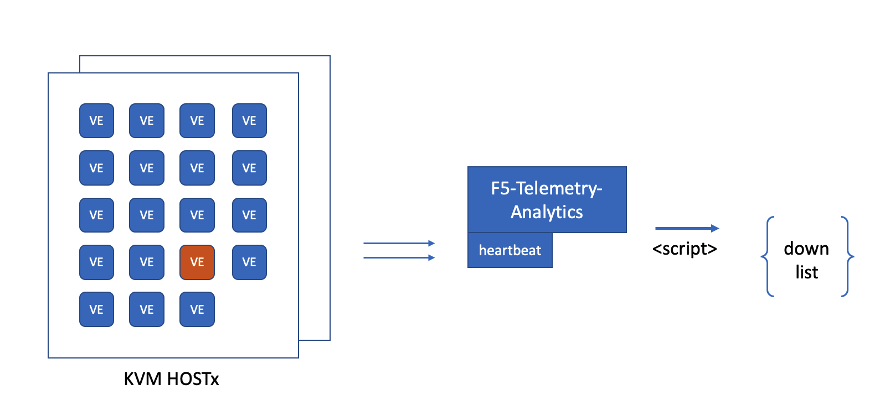

# Using heartbeat for BIG-IP VE monitoring

This program provides heartbeat enablement on F5-Telemetry-Analytics to do BIG-IP VE monitoring.

F5-Telemetry-Analytics is a ELK system. Using [heartbeat](https://www.elastic.co/guide/en/beats/heartbeat/current/index.html) can collect BIG-IP VEs' status. Thus, with elastic's query API, we can get the list of broken BIG-IP VEs.

* For details of the automation of enabling heartbeat in F5-Telemetry-Analytics, see [./enable.sh](./enable.sh).
* For details of elastic's query API for getting broken list, see [./downlist.sh](./downlist.sh).

## heartbeat Configuration

Refer to [./monitors.d/http.yml](./monitors.d/http.yml), which will be copied to CTRLBOX /etc/heartbeat folder in enable.sh.